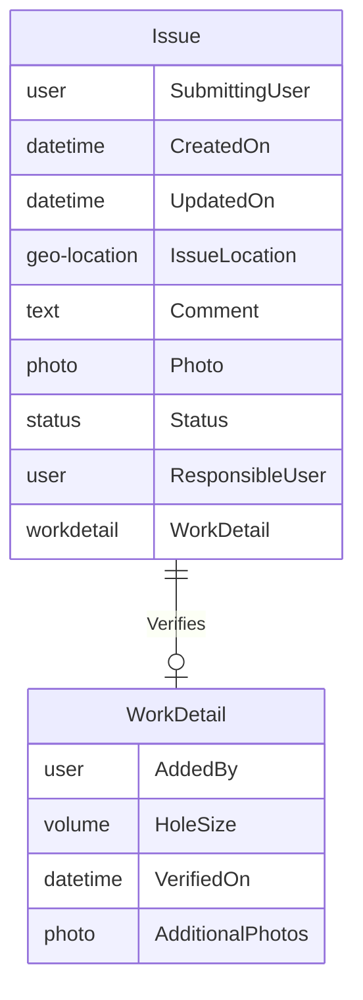
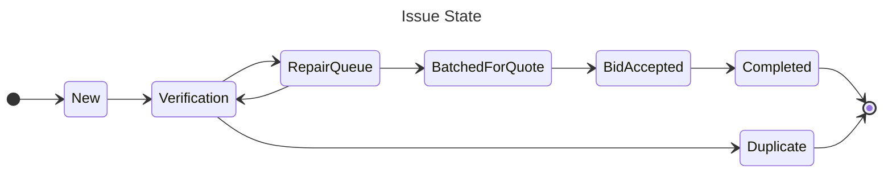

# Civic OS: Open Source Software to Empower Open Governance
Last Revised 2023-09-04

## Contact
For more information, or to collaborate, contact [Dan Kurin](mailto:dkurin@swiftlet.technology)

# Guiding Principles
## Open Government
Transparency and accountability are foundational to successful democratic governance. In order for citizens to be informed, they must have ready access to information to make good decisions about who to support, and how to vote in elections and on referenda.

In Civic OS, accountability is achieved by enforcing the justification of decisions; in other words, forcing leaders to justify key decisions. In order for an individual to decide if he supports an action, he must be able to understand the rationale behind that decision.
## Open Data
All data is not created equal. In order to make data open and usable the Open Data Charter has published [6 key
principles](https://opendatacharter.net/principles/):
- Open By Default
- Timely and Comprehensive
- Accessible and Usable
- Comparable and Interoperable
- For Improved Governance & Citizen Engagement
- For Inclusive Development and Innovation

Civic OS supports these principles by enforcing structured data and automatically creating Application Program Interfaces (APIs) to provide appropriate access to the stored data.
## Open Source
The term “open source” can have a number of meanings but Civic OS uses the definition consistent with “free software” according to the [Free Software Foundation](https://www.fsf.org/about/what-is-free-software).

The two primary outcomes of this philosophy are democratic development and lower cost of entry. Democratic development allows entities to contribute to development (in code, financial, and administrative contributions) to influence the system’s evolution. This results in a system that is useful for a broad range of diverse organizations. Lower cost of entry is realized by the $0 licensing fees inherent in Free/Open Source software. When development is performed in the open, the cost is shared by an entire community.

Software Licensing is a complex issue with many, diverse opinions. It is the author's opinion that software employed by governments best serve the public interest when their development is required to be shared with the community (as in AGPL) rather than value captured by private corporations.

# Goals
## Raise the level of abstraction
We believe that most information systems or processes can be abstracted in a way that a non-technical person can describe it if provided with the right tools. Similarly, the system for storing this information should allow that same non-technical person to understand and (most critically) contribute to the system's creation.
## Tools, not Products
Civic OS is a tool designed to allow experts in the information domain to create and maintain information systems without writing software code. As such, the system will not be complete without input from the organization operating the system but rather a completed system is created using Civic OS.
## Runs anywhere
This software is created to allow any organization to setup and administer their own instance of the application. You own the data and the software.

# Abstractions
To accommodate breaking a system into components, we propose the following abstractions. Every abstraction can be thought of as a computing primitive (in the vein of a "File" or "Folder") which may have configurable properties, but can be represented by a graph or diagram to visually represent its construction. These graphs are a key enabler to bridge the gap between technical and non-technical ideas and persons.
## Example
To illustrate how these abstractions work together to build a complete system, this paper will use an example system built to manage pothole complaints: **The Pot Hole Observation (PHO) system**.

The PHO system allows a citizen to report a road issue to their local government and see as the issue is resolved. PHO also allows the road commission to track each issue, assign work, and collect issues into a bid. Following Open Data principles, the original reporter can see the status of their issue.
## Abstraction: Schema
A Schema is a structured set of information in a tabular form (having multiple records of the same type). A single schema comprises a collection of fields, each with a type (text, number, money, etc.) and relationships to other schemas or nested sub-schemas. Validity rules are also configurable to enforce data input and preserve data integrity (e.g. `Location` is required, or `End Date` must be after `Start Date`).

Every Schema is described by an Entity Relationship Diagram.

### Example
A local resident notices a large pothole forming in front of their house and decides to do something about it. They log in to PHO with their Facebook account and are presented with a map allowing them to designate the location of the pothole. They add some comments or a photo and create the `Issue`. The issue's `Status` is automatically set to `New`.

Once Road Crew member verifies the issue, they create a `WorkDetail` record. The `WorkDetail` is connected to a specific `Issue` and includes more technical details than the reporting resident could provide: Volume of the hole, repair estimate, and additional photos. Zero or One `WorkDetail` records exist for each `Issue`.
### Properties
Every Schema may have a number of configurable properties that alter its behavior.
#### Permissions
Permissions define who can view records and who can edit records. For example:
- Functional permissions
  - Owner of record can edit
  - Anyone can view records marked as "Complete"
- Role-based permissions
  - Members of the `Road Crew` role can view `Work Order` records
  - Members of the `Dispatch` role can create `Schedule` records
#### Audit Log
When a record is updated, a log is automatically created to note the changed values as well as the user who made the update.
#### Search
Specific fields may be configured to make records easily searchable.
#### Data Sharing Management
Create and manage data access leases. These can be time-limited and assigned to particular users and organizations to allow read and/or write access to specific schemas.
- For-profit companies to build plugins, extensions, or services
- Government Agencies to facilitate data-sharing
- Non-profits for academic research
#### Work Queues
A particular User or Role may configure a list of Schemas that meet certain criteria. Following the PHO example:
- A member of the Road Crew may wish to see all Issues assigned to them.
- A supervisor may wish to see all Issues with the Verification Status
## Abstraction: Workflow
A workflow is a constraint placed upon a Schema that controls certain aspects of the data stored in the Schema. In order to create a Workflow, one property of the Schema must be designated to represent the Schema's State, usually with a set of pre-defined values.

Every Workflow is defined by a State Diagram:

### Example
New `Issues` are created with the `New` Status. When the `Issue` is assigned to a member of the Road Crew to gather more information, the Status is updated to `Verification`.

Once the `Issue` is Verified, it is either moved to the `RepairQueue` state or the `Duplicate` state in the event multiple residents reported the same `Issue`.

If enough time passes (or a mistake is believed), the `Issue` may be moved back to the `Verification` state. This transition is explicitly allowed by the system design and represented on the State Diagram.

In this community, road repairs are bid out to contractors. When a particular threshold of work is met, a batch of `Issues` are packaged into a single Request For Quote (RFQ). Each of those `Issues` is moved to the `BatchedForQuote` state.

Similarly, when the Bid is accepted, each `Issue` state is updated to reflect the new status `BidAccepted`.

Finally, when the contractor has completed the work, each `Issue` in the batch is updated to reflect the `Completed` status.
### Properties
#### Allowed States

#### Allowed Transitions

## Abstraction: Events/Triggers
### Example
- The `Submitting User` should be notified whenever the status of their `Issue` changes
- When a `Bid` is accepted, update the status of any associated `Issues`

# Governance
The Civic OS software is designed to maximize civic benefit, which should direct the legal structure of the supporting organization. This organization has not yet been formed, but we believe that a non-profit or Public Benefit Corp. will provide the best opportunities to mature and spread the use of Civic OS.
## Decision-making

## Representation

# Technical Implementation
## User Experience
## Software Architecture