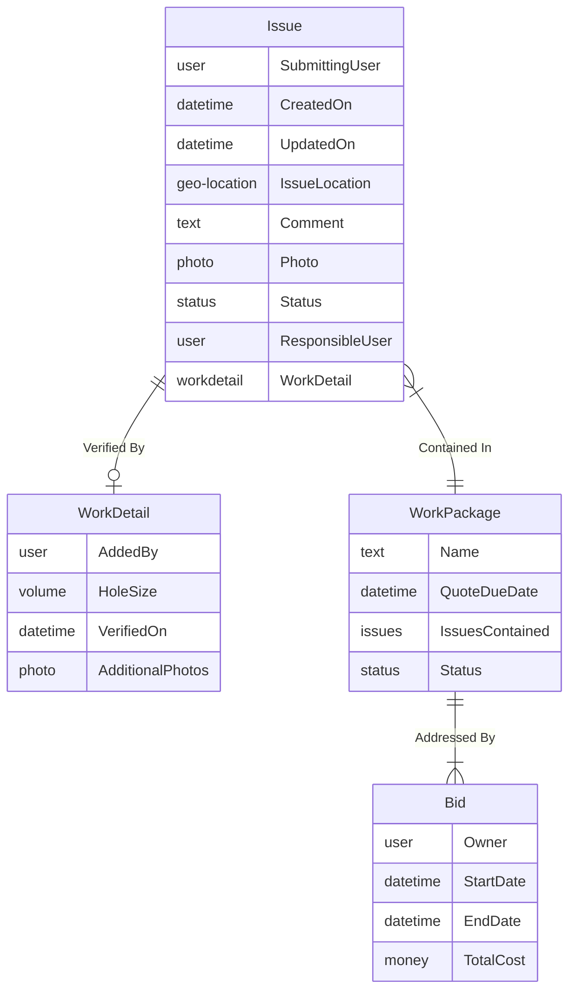
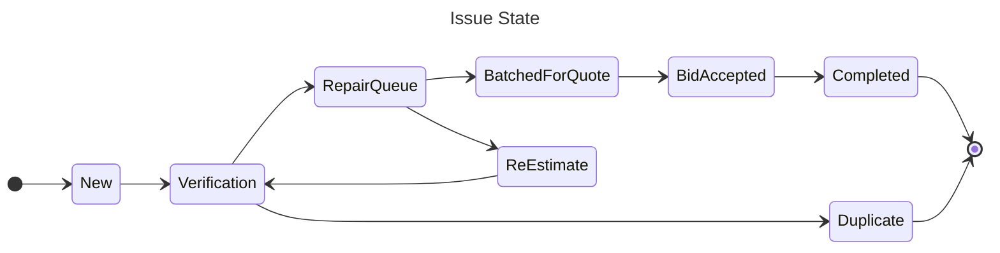
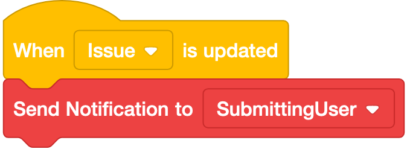
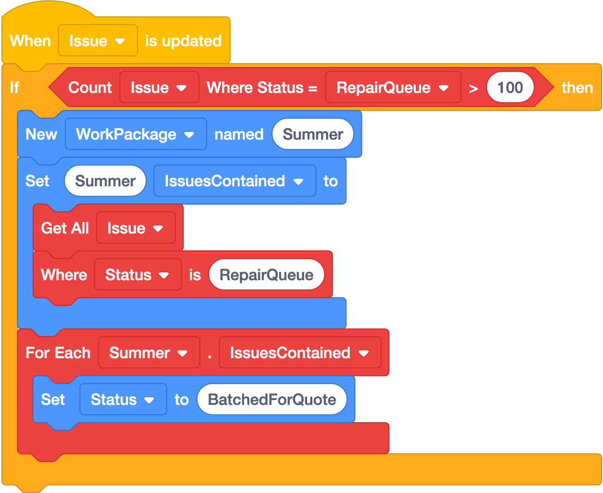
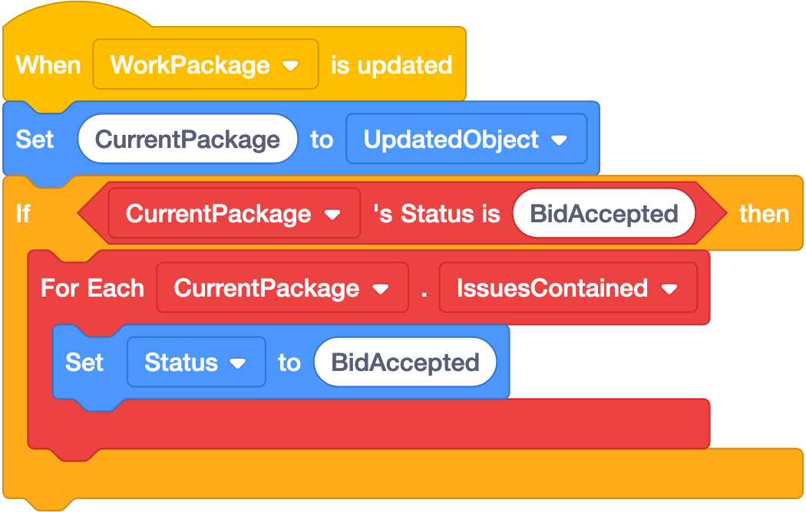
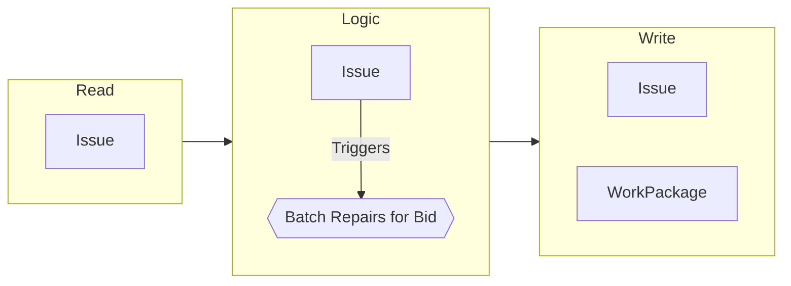
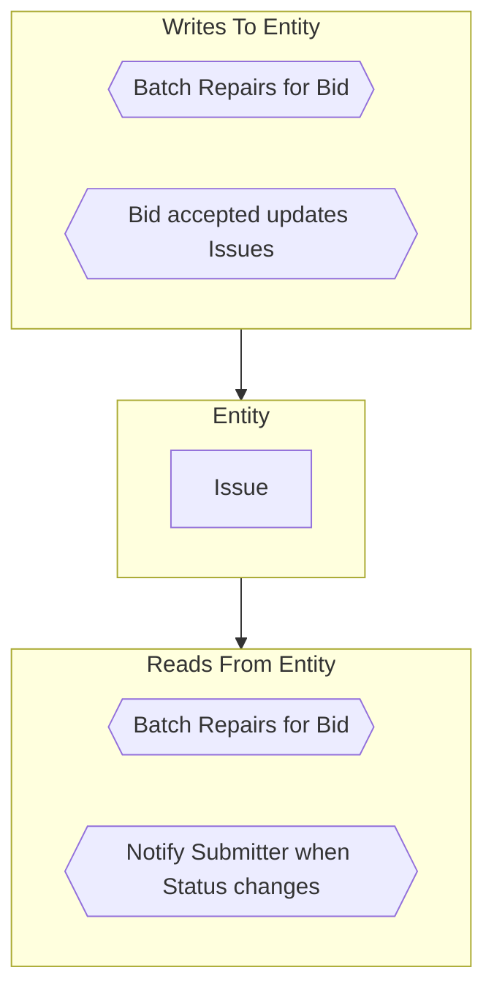

# Civic OS: Open Source Software to Empower Open Governance
Civic OS is a low/no-code software platform which allows government agencies to build and tailor their own information systems and logic without writing code.

This document last revised 2023-11-15

## Contact
For more information, or to collaborate, contact [Dan Kurin](mailto:dkurin@swiftlet.technology)

## Go Deeper
Also see:
- [Guiding Principles](GuidingPrinciples.md)
- [Technical Architecture](TechnicalArchitecture.md)

# Project Goals
## Raise the level of abstraction
We believe that most information systems or processes can be abstracted in a way that a non-technical person can describe it if provided with the right tools. Similarly, the system for storing this information should allow that same non-technical person to understand and (most critically) contribute to the system's creation.

Civic OS provides the platform for automatically translating concepts and ideas into a concrete structure that handles the most common tasks of information management: Definition, Input, and Display.
## Tools, not Products
Just as no single community is identical to another, no government agency's needs are 100% identical to another. Civic OS is a _tool_ designed to allow experts in the information domain (those familiar with the information managed) to create and maintain information systems without writing software code. As such, the system will not be complete without input from the organization operating the system but rather a completed system is created using Civic OS.

Where similarities exist, templates may be shared within a community of users to ease the burden of creating systems from nothing.
## Runs anywhere
This software is created to allow any organization to setup and administer their own instance of the application. You own the data and the software.

# Abstractions
To accommodate breaking an information system into components, we propose the following abstractions. Every abstraction can be thought of as a computing primitive (in the vein of a "File" or "Folder") which may have configurable properties, but can be represented by a graph or diagram to visually represent its construction. These graphs are a key enabler to bridge the gap between technical and non-technical ideas and persons.
## Example
To illustrate how these abstractions work together to build a complete system, this paper will use an example system built to manage pothole complaints: **The Pot Hole Observation (PHO) system**.

The PHO system allows a citizen to report a road issue to their local government and see as the issue is resolved. PHO also allows the road commission to track each issue, assign work, and collect issues into a bid. Following Open Data principles, the original reporter can see the status of their issue.
## Abstraction: Schema
A Schema is a structured set of information in a tabular form (having multiple records of the same type). A single schema comprises a collection of fields, each with a type (text, number, money, etc.) and relationships to other schemas or nested sub-schemas. Validity rules are also configurable to enforce data input and preserve data integrity.

Every Schema is described by an Entity Relationship Diagram.

### Example
A local resident notices a large pothole forming in front of their house and decides to do something about it. They log in to PHO with their Facebook account and are presented with a map allowing them to designate the location of the pothole. They add some comments or a photo and create the `Issue`. The issue's `Status` is automatically set to `New`.

Once Road Crew member verifies the issue, they create a `WorkDetail` record. The `WorkDetail` is connected to a specific `Issue` and includes more technical details than the reporting resident could provide: Volume of the hole, repair estimate, and additional photos. Zero or One `WorkDetail` records exist for each `Issue`.

A `WorkPackage` is created to address a set of `Issues`.

The road commission solicits `Bids` for each `WorkPackage`.
### Properties
Every Schema may have a number of configurable properties that alter its behavior.
#### Record Validation
Each Schema may have any number of rules to enforce that the entered information meets some criteria. These rules may be as simple as marking a field as Required (e.g. `Location`), forcing one value to be greater than another (`End Date` must be after `Start Date`), or depend on other fields (`ResponsibleUser` is required if `Status` is `Verification`; see [Workflow: Allowed States](#allowed-states)).
#### Permissions
Permissions define who can view records and who can edit records. For example:
- Functional permissions
  - Owner of record can edit
  - Anyone can view records marked as "Complete"
- Role-based permissions
  - Members of the `Road Crew` role can view `Work Order` records
  - Members of the `Dispatch` role can create `Schedule` records
#### Audit Log
When a record is updated, a log is automatically created to note the changed values as well as the user who made the update.
#### Search
Specific fields may be configured to make records easily searchable.
#### Data Sharing Management
Create and manage data access leases. These can be time-limited and assigned to particular users and organizations to allow read and/or write access to specific schemas.
- For-profit companies to build plugins, extensions, or services
- Government Agencies to facilitate data-sharing
- Non-profits for academic research
#### Work Queues
A particular User or Role may configure a list of Schemas that meet certain criteria. Following the PHO example:
- A member of the Road Crew may wish to see all Issues assigned to them.
- A supervisor may wish to see all Issues with the Verification Status
## Abstraction: Workflow
A workflow constrains a Schema to control certain aspects of the data stored in the Schema. In order to create a Workflow, one property of the Schema must be designated to represent the Schema's State, usually with a set of pre-defined values.

Every Workflow is defined by a State Diagram:

### Example
New `Issues` are created with the `New` Status. When the `Issue` is assigned to a member of the Road Crew to gather more information, the Status is updated to `Verification`.

Once the `Issue` is Verified, it is either moved to the `RepairQueue` state or the `Duplicate` state in the event multiple residents reported the same `Issue`.

If enough time passes (or a mistake is believed), the `Issue` may be moved back to the `Verification` state by way of the `ReEstimate` state. This transition is explicitly allowed by the system design and represented on the State Diagram.

In this community, road repairs are bid out to contractors. When a particular threshold of work is met, a batch of `Issues` are packaged into a single Request For Quote (RFQ). Each of those `Issues` is moved to the `BatchedForQuote` state.

Similarly, when the Bid is accepted, each `Issue` state is updated to reflect the new status `BidAccepted`.

Finally, when the contractor has completed the work, each `Issue` in the batch is updated to reflect the `Completed` status.
### Properties
#### Allowed States
Workflow States are constrained to a pre-defined list of States and new States can not be created by ordinary users. In a well-designed system, this constraint clarifies the intended process and eases analysis of the data present in the system.

Allowed States can also be combined with [Schema: Record Validation](#record-validation) to ensure particular fields are filled at certain points in the process.
#### Allowed Transitions
Illustrated as arrows in the State Diagram, valid transitions are enforced and represent pathways for information to move through the given process. This design tool gives varying participants the confidence that information is ready for action when it is present in a particular state.
## Abstraction: Logic
A great many systems could be created using the `Schema` and `Workflow` abstractions, but additional abstraction is needed in order to accommodate a further level of complexity. Through a conditional `Logic` system, Schema Records may be created or modified based on prescribed Schema conditions.

`Logic` is described by programming blocks in the format popularized by the [Scratch](https://www.scratchfoundation.org/) programming language.
<!-- Consider using Snap! https://snapextensions.uni-goettingen.de/ or Blockly https://github.com/nicolaipoehner/blocklysql instead of Scratch -->
### Examples
| Name | Description | Block Diagram |
|--|--|--|
| **Notify Submitter when Status changes** | The `Submitting User` should be notified whenever the status of their `Issue` changes |  |
| **Batch Repairs for Bid** | When 100 `Issues` are in the `RepairQueue` status, open a new `Bid` | %3E%20then%0A%09New%20%5BWorkPackage%20v%5D%20named%20%5BSummer%5D%3A%3Amotion%0A%09Set%20%5BSummer%5D%20%5BIssuesContained%20v%5D%20to%20%7B%0A%09%09Get%20All%20%5BIssue%20v%5D%0A%09%09Where%20%5BStatus%20v%5D%20is%20%5BRepairQueue%5D%0A%09%7D%3A%3Amotion%0A%09For%20Each%20%5BSummer%20v%5D.%5BIssuesContained%20v%5D%20%7B%0A%09%09Set%20%5BStatus%20v%5D%20to%20%5BBatchedForQuote%5D%3A%3Amotion%0A%09%7D%0Aend%0A) |
| **Bid accepted updates Issues** | When a `Bid` is accepted, update the status of any `Issues` associated to the appropriate `WorkPackage` |  |
### Relationships
Systems like this, linked together by a series of background actions, can be difficult to manage. It is imperative that the user is able to visualize relationships between Entities, especially when one action may cause another.  We propose a navigable diagram system showing how Logic relates one Entity to another.

As an example, consider the above Logic block "**Batch Repairs for Bid**". This diagram shows that the Logic reads from the `Issue` Entity, is triggered by changes to the `Issue` Entity, and writes to both the `Issue` and `WorkPackage` Entities:

Similarly, the user may view the logic connected to an Entity:
