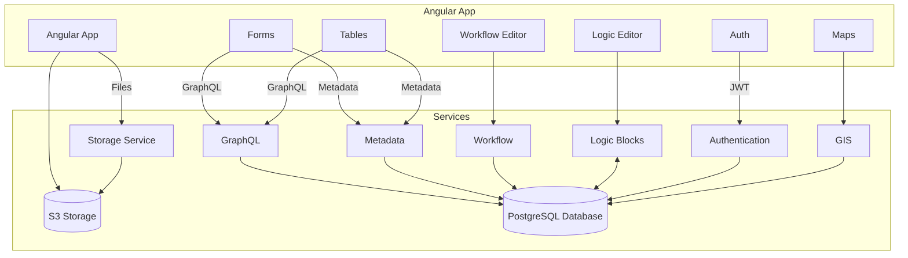

# Technical Architecture
Last Revised 2023-10-15
## User Experience
## Software Architecture
The inspiration behind this architecture is SQL and its declarative model. When you write SQL scripts, you are telling the database engine _what_ you want, not _how_ you want the engine to do it. This is a very powerful mental model and can allow the system to bridge the gap between non-technical personnel and very technical systems.
### Architecture Diagram

## PostgreSQL
Postgres is an incredibly capable database engine with standard features often written into the service layer of software applications. Postgres offers declarative interfaces for:
- Row-level Security
- Data Validity Checking
- Trigger Functions

The Postgres community has also developed plugins for:
- Geographic Data (PostGIS)
- GraphQL (pg_graphql)
## Services
### Authentication
Authenticates a user's identity and issues a JSON Web Token (JWT) bearing the user's unique ID. All other services will validate this JWT and inject the unique ID for use with PostgreSQL's Row-Level Security.
### GraphQL
### [Metadata](https://github.com/civic-os/metadata-service)
Shares information about schema (data structure and validation) with the frontend. Allows automatic generation of Forms and Tables.

This service also enables configurable views such as menus and field ordering.
### Workflow
Enables creation and management of Workflow objects based on existing Schemas. Creates the low-level rules that enforce Workflow rules.
### Logic
Enables creation and management of Trigger functions within the PostgreSQL database. Translates functions between the programming block abstraction and SQL functions which are executed by Postgres.

Gathers Trigger function relationships for graphing. Allows displaying functions in the UI to make hidden behavior more obvious.
